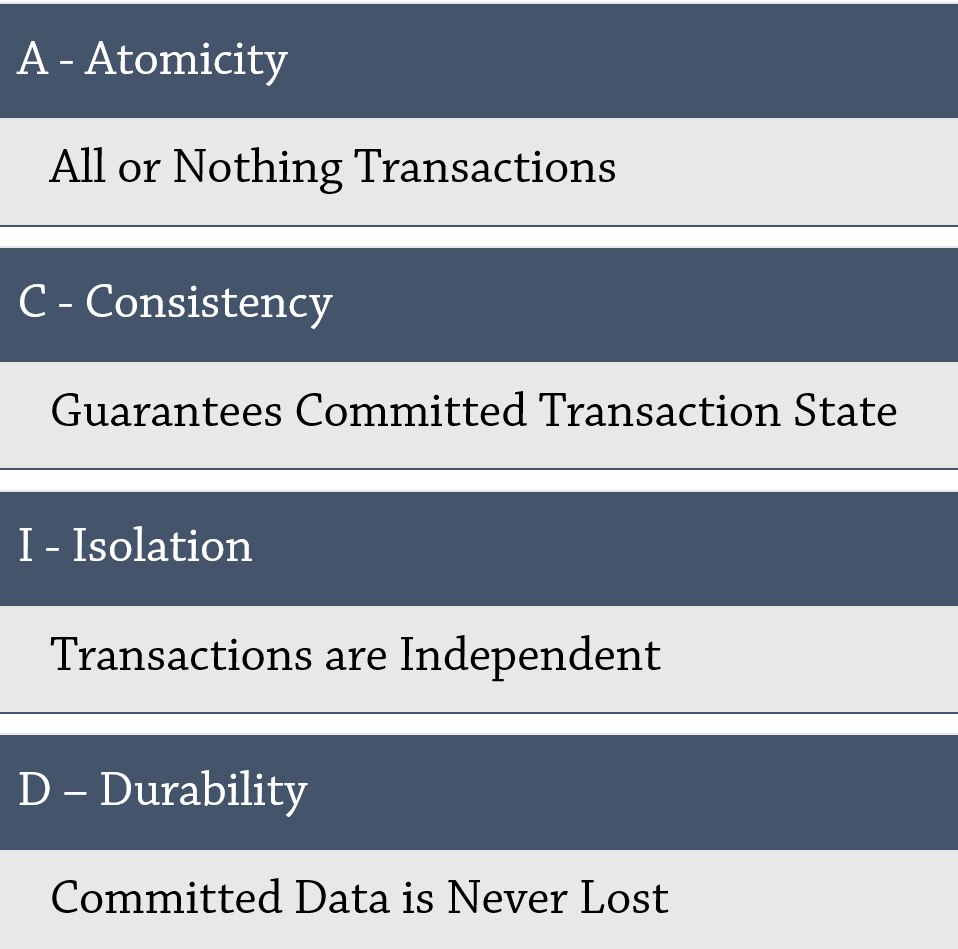

## Analysis of RDMS (SQL)

### Abstract
### Introduction
At the time of implementation of any system, most of the problems faced are because of the outcome of a poor database design. In most of the cases it occurs that the system must be modified continuously in different regards because of the change in requirement of the users[1]. Thus, a need for a data storage system which provides a flexible, convenient, and effective method of defining, storing, and retrieving the information is fulfilled by relational database design. 

The traditional database systems have been based on the relational model which are broadly known as SQL databases, as they are named after the language they were queried by. In Relational Database Management System (RDBMS) data is organized in database tables, fields, and records. Every RDBMS tables contains database table rows. Every database table row contains one or more database table fields. RDBMS collects the data into collection of tables, that might be related by common fields (database table columns). Most RDBMS uses SQL as database query language to store, access and perform various operations on the data stored in the database. RDBMS also gives relational operators to control the data collected into the database tables. The most famous RDBMS are MySQL, PostgreSQL, and Oracle Database. The aim of the relational database design is to produce a set of relation schema that allows us to store information without unnecessary redundancy and it retrieves information easily. The relational data model is the most used model, and a large majority of present database systems are based on the relational model[1].

Figure 1 RDBMS Structure [2]

### Background

Storage of information in the form of computerized databases started in early 1960s, when various governmental offices, businesses, libraries etc. saw the cost-effective option with the use of computers. The most popular data models currently were the network database model, the hierarchical database model, and the flat-file database model [3]. Many of these models had various disadvantages such as complex representation of database, lack of structural independence and no support for many to many relationships [4].

Figure 2 Flat File Database model

Figure 3 Hierarchical Database Model

#### RDBMS
RDBMS overcame most of these limitations by providing simple database design, a language to access data easily, support for large amounts of data with multi-level relationships between data sets and many more. Dr. E.F. Codd, an IBM research scientist and mathematician, designed the relational model. Also, in this model, the database’s schema is disconnected from physical information storage, and this became the standard principle for database systems [3]. The main focal points of this model were to further reduce data redundancy and to improve data integrity within database systems [1]. In RDBMS, the data is stored in tables, or relations and these tables are divided into rows (records) and columns (fields). Relational databases are famous for handling multitudes of data and complex queries.

Both RDBMS and NoSQL databases provide various benefits of their own and aim to solve a single problem i.e. an efficient way to store information, but neither is a universal solution for every application. The developer must learn the advantages and disadvantages of each and choose the database based on the optimal set of tradeoffs that one can make based on their application. To explicate our analysis and to establish the differences between RDBMS and NoSQL, we choose PostgreSQL, a free and open-source RDBMS and MongoDB, a document-oriented NoSQL database. Both the databases are multi-platform software.

##### PostgreSQL
PostgreSQL (postgres) is a powerful and object-relational database system that uses SQL language. The PostgreSQL, written in C, was first developed in 1986 which originated as the successor of Ingres data and has more than 30 years of active development on the core platform [5].

Figure 4 Popular Database Engine Rankings
 
Label - PostgreSQL is gaining more popularity and is been adapted by many developers over legacy databases like MySQL, Oracle, IBM DB and Microsoft SQL. 

PostgreSQL has earned a strong reputation for its proven architecture, reliability, data integrity, robust feature set, extensibility, and the dedication of the open source community behind the software to consistently deliver performant and innovative solutions. PostgreSQL supports all major operating systems and is highly extensible such as, it provides a way to define your own data types, functions and supports code from different programming languages [5]. PostgreSQL has proven to be highly efficient, secure, flexible, and scalable in storing, managing, and accessing the data stored. Some of the top tech companies to use postgres are Reddit, The Guardian and Instagram. This database has also been recognized for its robust and efficient way to accommodate multiple concurrent users [6].

### Analysis of rdbms and nosql (Postgres, mongodb)
 

#### Design principles
Dr. E. F. Codd defined twelve principles [7] of relational databases which continue to be the litmus test for database programs to validate their “relational” characteristic. These rules only apply to the database engine rather than to the applications development and the database engine that does not meet all the rules is not fully ‘relational’. Though most of the modern databases does not comply with all the rules, they still are considered relational. 

In a well-designed relational database data is stored in the form of tables and can be accessed at any time. Each table comprises of rows and columns. The data here is stored in the form of objects. A proper RDBMS contains no duplicate rows, and each table has a primary key, a unique identifier constructed from one or more columns [8]. A table can be linked to another table through the other table’s primary key. The column (key) of the current table which is referencing the other table’s primary key is called the Foreign key. A table can have multiple foreign keys. Along with tables RDBMS also have views which are searchable objects. Though data will not be stored in the views, they are referred to as virtual tables since they can be queried like tables [9]. RDBMS has an interesting feature called referential integrity. Referential integrity states that a value to be entered in the foreign key field should be in the primary key field first. In RDBMS systems data must closely follow the database definition. If for some reason, there is any discrepancy then database will throw an error [8].

#### Properties

The two basic properties of RDMS are CRUD, the necessary operations to implement a persistent storage application and ACID, the properties to maintain consistency across the database.

**CRUD** – stands for Create, Read, Update and Delete. These are the basic operations that the RDBMS must allow on the records in the database. These functions are not only performed on the object records but also on the indexes used to search those records. The database engine must provide the interface for the user to perform these operations, to read or modify the data, on the database. Most the RDBMS use SQL language to perform CRUD operations or to communicate with the database [10].

**ACID** – stands for Atomicity, Consistency, Isolation and Durability. These are the methods that attempt to define and solve the concurrency issues in the RDBMS. Atomicity defines that any transaction must be atomic i.e. must be completed in full or must be never done. This methods groups all the data together as single unit, as an atomic unit of data. Consistency defines that the database must maintain a stable state, be consistent, before and after any transaction(s) rather than an in-consistent or corrupted state. Isolation defines that multiple transactions can occur concurrently, each in its own isolated state without interference and without leading to any inconsistency in the database. Durability defines that the data, once written or modified in the database, must be written to the disk and persist even if a system failure occurs [10].    

Figure 4 RDBMS ACID properties
Label - All the relational database systems must support the above CRUD and ACID properties. 

#### Features
#### Indexing
#### Data models  
#### Comparison(PostgreSQL and MongoDB)
#### Security features

 
 

### Case study (big data)
### Conclusion
### References
1. Introduction to RDMS [http://www.rjspm.com/PDF/BCA-428%20Oracle.pdf](http://www.rjspm.com/PDF/BCA-428%20Oracle.pdf)
2. Relational database [https://en.wikipedia.org/wiki/Relational_database](https://en.wikipedia.org/wiki/Relational_database)
3. Network and hierarchical Database Models [https://www.quickbase.com/articles/timeline-of-database-history#:~:text=1980s,network%20and%20hierarchical%20database%20models](https://www.quickbase.com/articles/timeline-of-database-history#:~:text=1980s,network%20and%20hierarchical%20database%20models)
4. Hierarchical Database Model [https://www.ukessays.com/essays/information-technology/hierarchical-data-model.php](https://www.ukessays.com/essays/information-technology/hierarchical-data-model.php)
5. Official PostgreSQL Site - About [https://www.postgresql.org/about/](https://www.postgresql.org/about/)
6. PostgreSQL WikiPedia [https://en.wikipedia.org/wiki/PostgreSQL](https://en.wikipedia.org/wiki/PostgreSQL)
7. Principles of Relational Databases [https://www.oreilly.com/library/view/sql-in-a/1565927443/ch01s05.html](https://www.oreilly.com/library/view/sql-in-a/1565927443/ch01s05.html)
8. Referential Integrity and Relational Database Design [https://web.mit.edu/11.521/www/lectures/lecture10/lec_data_design.html](https://web.mit.edu/11.521/www/lectures/lecture10/lec_data_design.html)
9. Relational Database View [https://www.essentialsql.com/what-is-a-relational-database-view/#:~:text=A%20database%20view%20is%20a,contain%20a%20subset%20of%20information](https://www.essentialsql.com/what-is-a-relational-database-view/#:~:text=A%20database%20view%20is%20a,contain%20a%20subset%20of%20information)
10. ACID and CRUD operations [https://informationtechsales.blogspot.com/2014/11/databases-sql-crud-and-acid-102.html](https://informationtechsales.blogspot.com/2014/11/databases-sql-crud-and-acid-102.html)